## Festival de Conciertos en Colombia

*Evidencia de operaciones realizadas en MongoDB (terminal)*

---

### 1. Conexión y Selección de Base de Datos

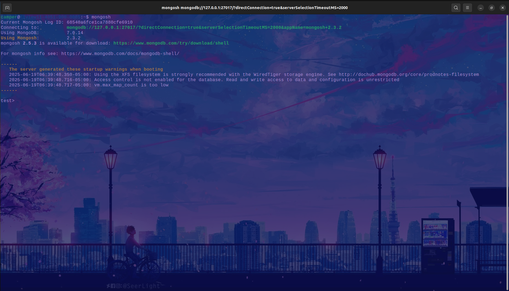

### 2. Creación de la Base de Datos

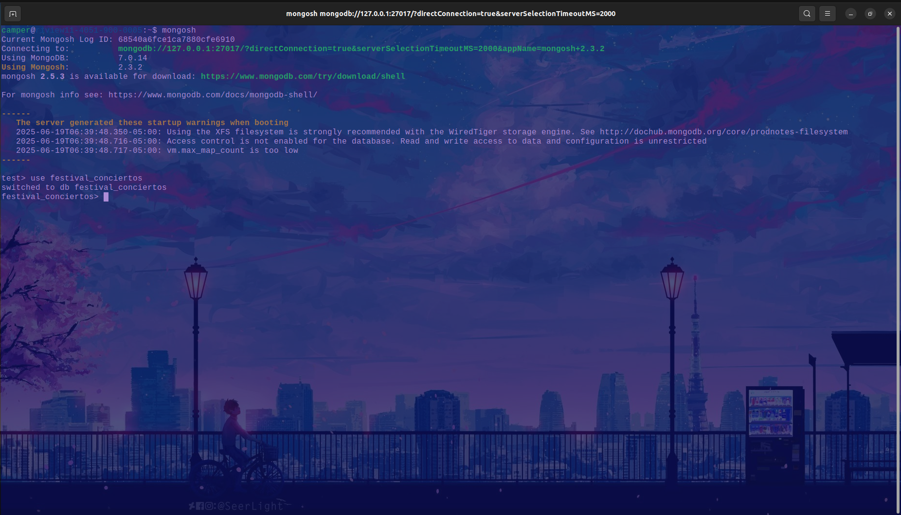

---

### 3. Inserción de Datos Iniciales

#### 3.1 Colección `bandas`

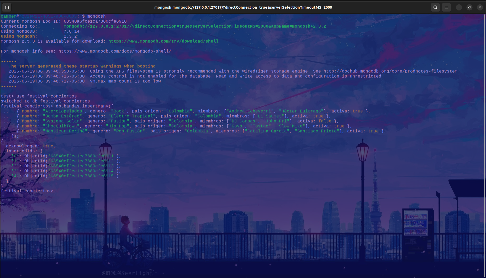

#### 3.2 Colección `escenarios`

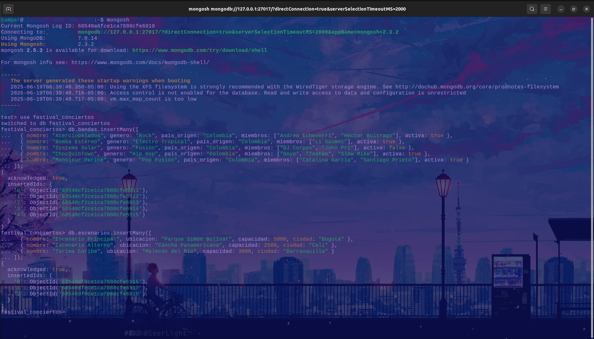

#### 3.3 Colección `presentaciones`

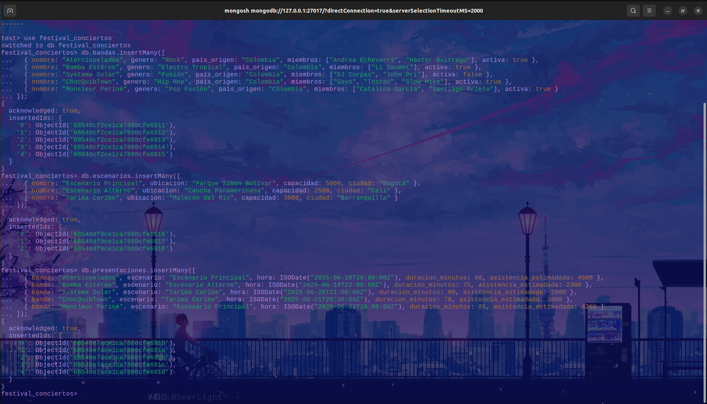

#### 3.4 Colección `asistentes`

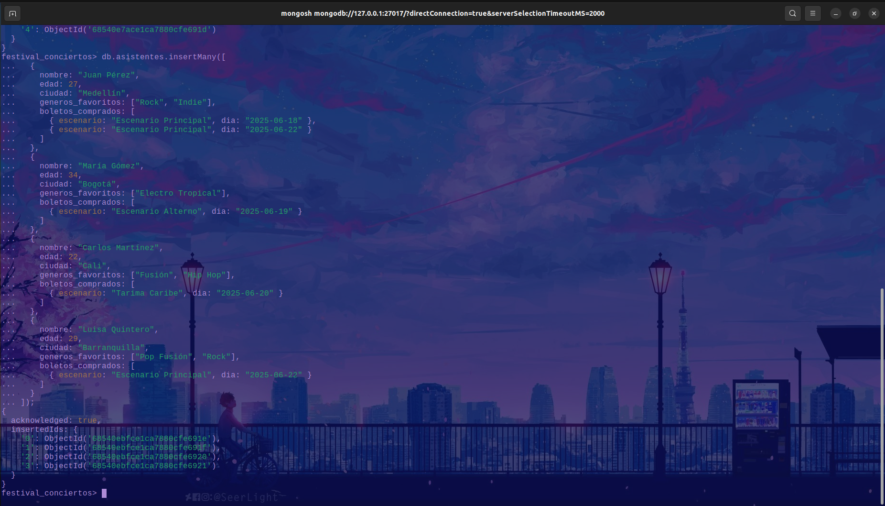

---

### 4. Consultas Realizadas

#### 4.1 Expresiones Regulares

* Bandas que empiezan con “A”:
  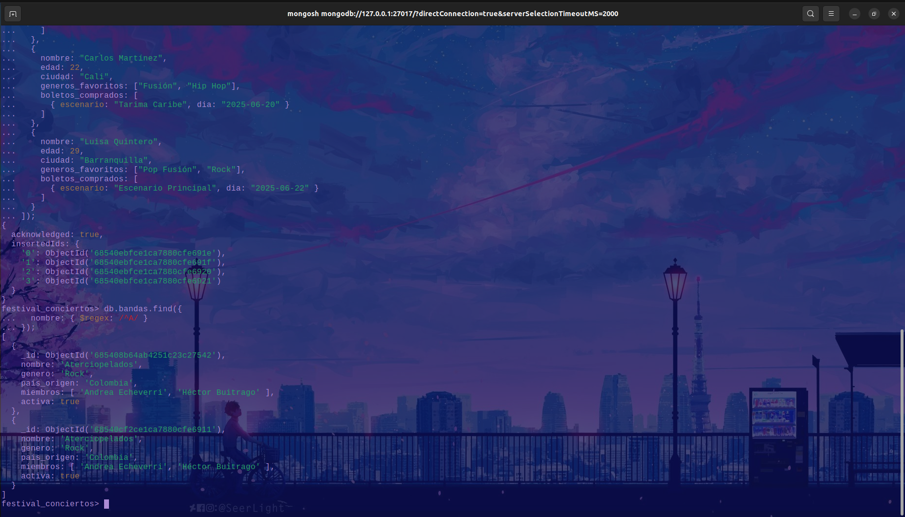

* Asistentes con “Gómez” en el nombre:
  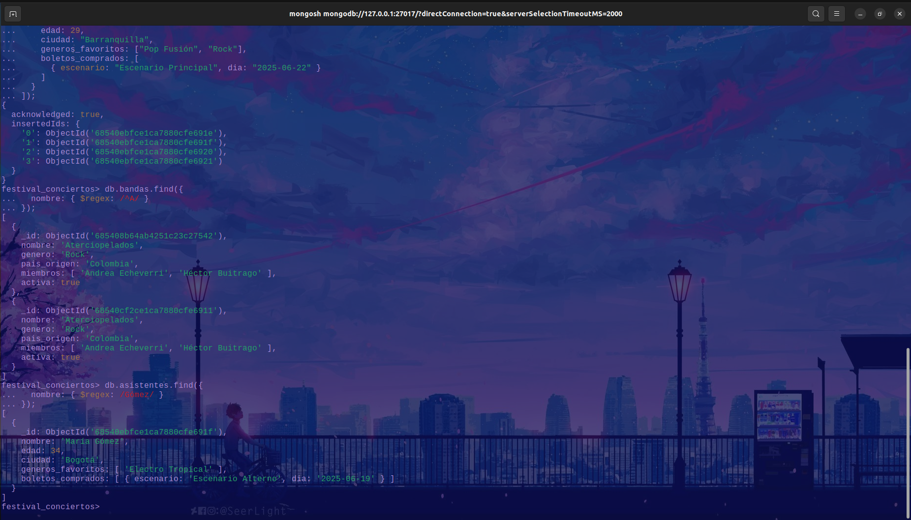

#### 4.2 Operadores de Arreglos

* Asistentes con “Rock” en géneros favoritos:
  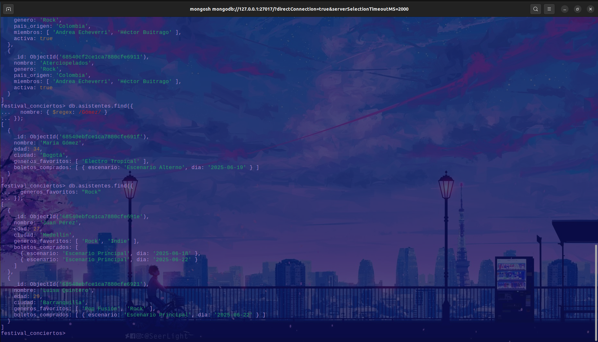

#### 4.3 Aggregation Framework

* Conteo de presentaciones por escenario:
  

* Promedio de duración de presentaciones:
  

---

### 5. Funciones en `system.js`

* Archivo `system.js` cargado:
  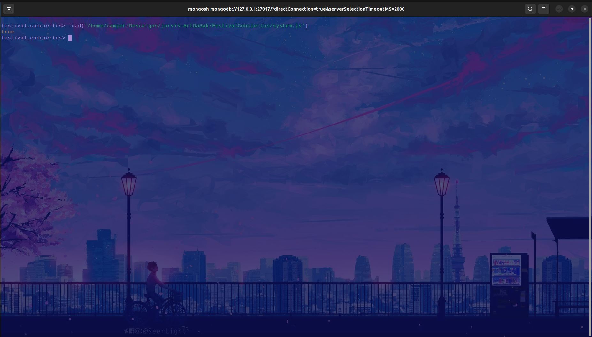

* Prueba `escenariosPorCiudad("Bogotá")`:
  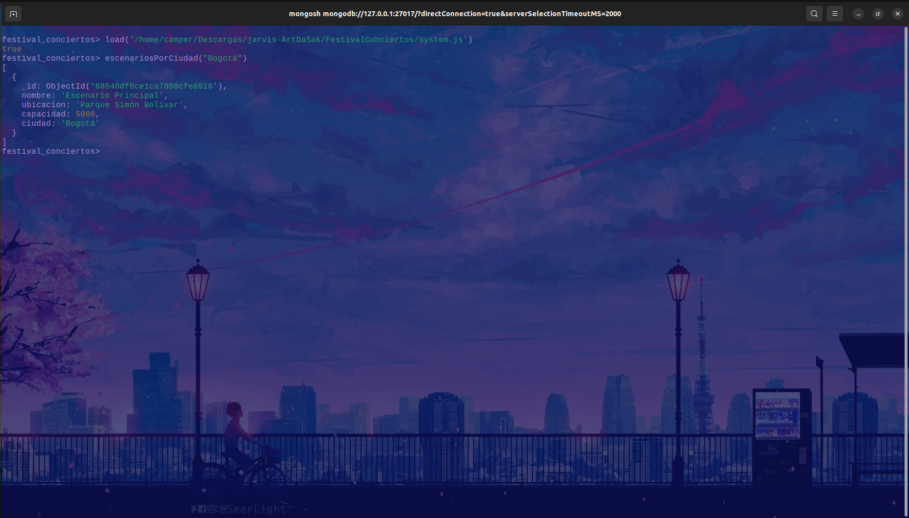

* Prueba `bandasPorGenero("Rock")`:
  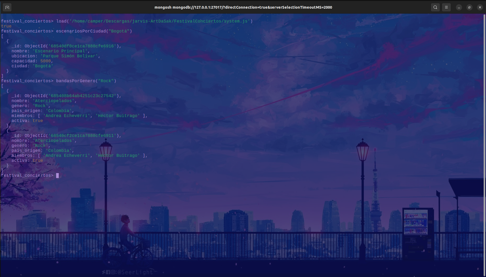

---

> Todas las imágenes muestran la ejecución exitosa de cada operación en MongoDB, evidenciando el cumplimiento de los requerimientos solicitados.
