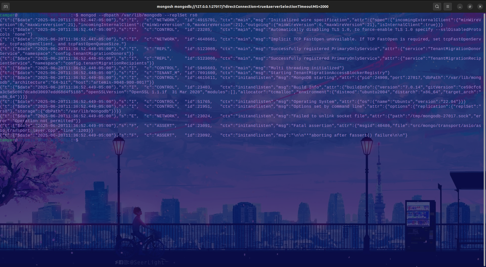
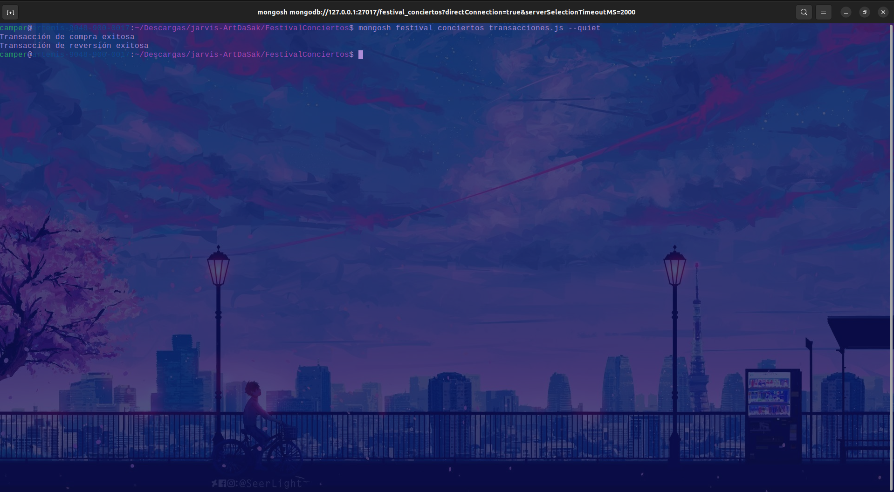
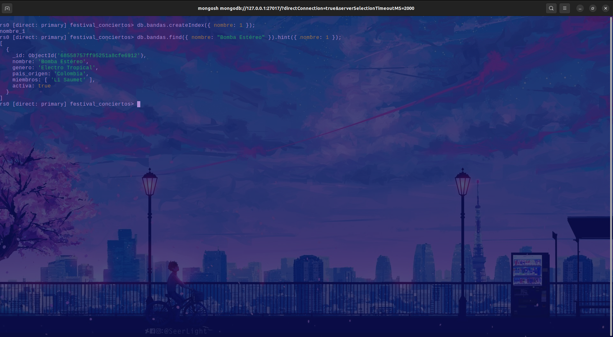
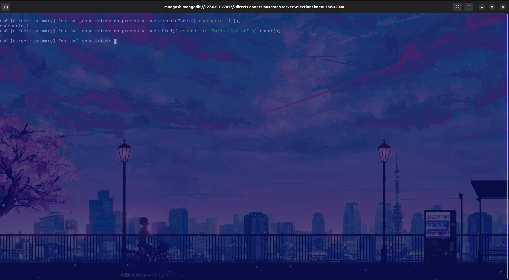

<h1 align="center"> Festival de Conciertos</h1>

Evidencia de operaciones realizadas en MongoDB (terminal).

---

### 1. Conexión a MongoDB Shell:

### 2. Creación y Selección de la Base de Datos:

---

### 3. Inserción de Datos Iniciales:

#### 3.1 Colección `bandas`:

#### 3.2 Colección `escenarios`:

#### 3.3 Colección `presentaciones`:

#### 3.4 Colección `asistentes`:

---

### 4. Consultas Realizadas:

#### 4.1 Expresiones Regulares:

* Bandas que empiezan con «A»:
  

* Asistentes con «Gómez» en el nombre:
  

#### 4.2 Operadores de Arreglos:

* Asistentes con «Rock» en géneros favoritos:
  

#### 4.3 Aggregation Framework:

* Conteo de presentaciones por escenario:
  

* Promedio de duración de presentaciones:
  

---

### 5. Funciones en `system.js`:

* Archivo [system.js](./system.js) cargado:
  

* Prueba `escenariosPorCiudad("Bogotá")`:
  

* Prueba `bandasPorGenero("Rock")`:
  

---

### 6. Configuración de Replica Set:

### 7. Ejecución del Archivo [transacciones.js](./transacciones.js):

### 8. Índices y Consultas:

#### 8.1 Índice en `bandas.nombre` y búsqueda por nombre:

#### 8.2 Índice en `presentaciones.escenario` y conteo de presentaciones:

#### 8.3 Índice compuesto en `asistentes.ciudad` y `edad`, consulta de asistentes de Bogotá menores de 30:

---

>[!NOTE]
> Todas las imágenes muestran la ejecución exitosa de cada operación en MongoDB, evidenciando el cumplimiento de los requerimientos solicitados.
